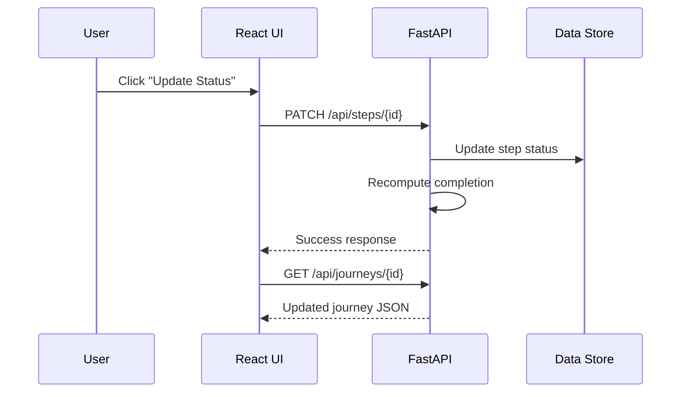
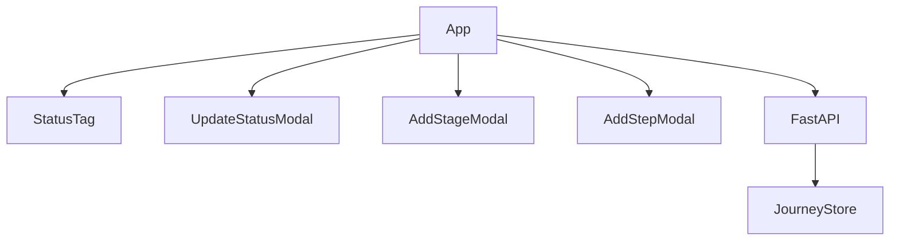

# Mini Milestone Journey Management System

A full-stack web application that allows users to manage a **Journey → Stages → Steps (Tasks)** workflow.
Each step has a status, and **completion percentages are calculated dynamically** at both stage and journey levels.

---

## ✨ Features

* View a journey with multiple stages and steps
* Sidebar with stages + mini progress bars
* Add / delete stages
* Add / delete steps
* Update step status via modal
* Automatic progress calculation
* Loading animations for slow API responses
* Error handling and empty-state handling

---

## 🧰 Tech Stack

### Frontend

* React (Vite)
* JavaScript
* CSS

### Backend

* Python
* FastAPI
* Uvicorn

---

## 📁 Final Project Structure

After full setup, your project will look like this:

```
milestone-journey/
│
├── backend/
│   ├── main.py
│   └── .venv/               # Python virtual environment (auto-created)
│
└── frontend/
    ├── package.json         # Frontend dependencies
    ├── vite.config.js       # Vite dev server + proxy config
    ├── node_modules/        # Auto-installed dependencies
    └── src/
        ├── App.jsx
        ├── App.css
        └── components/
            ├── StatusTag.jsx
            ├── UpdateStatusModal.jsx
            ├── AddStageModal.jsx
            └── AddStepModal.jsx
```

---

## 🧩 Prerequisites (Install Once)

### 1️⃣ Install Node.js (for React)

Download **Node.js LTS** from:
👉 [https://nodejs.org](https://nodejs.org)

Verify installation:

```powershell
node -v
npm -v
```

---

### 2️⃣ Install Python (for Backend)

Download Python **3.10 or above** from:
👉 [https://www.python.org/downloads/](https://www.python.org/downloads/)

Verify installation:

```powershell
python --version
```

---

## 🚀 Step-by-Step Setup (From Scratch)

You need **two terminals**:

* Terminal 1 → Backend
* Terminal 2 → Frontend

---

## 🔹 Step 1: Backend Setup (FastAPI)

### 1. Go to backend folder

```powershell
cd milestone-journey\backend
```

### 2. Create Python virtual environment

```powershell
python -m venv .venv
```

This creates a folder:

```
backend/.venv/
```

### 3. Activate virtual environment

```powershell
.venv\Scripts\Activate.ps1
```

### 4. Install backend dependencies

```powershell
pip install fastapi uvicorn "fastapi[all]"
```

### 5. Run backend server

```powershell
uvicorn main:app --host 127.0.0.1 --port 8000
```

You should see:

```
Uvicorn running on http://127.0.0.1:8000
```

### 6. Test backend

Open in browser:

* [http://127.0.0.1:8000/api/journeys/123](http://127.0.0.1:8000/api/journeys/123)
* [http://127.0.0.1:8000/docs](http://127.0.0.1:8000/docs)

---

## 🔹 Step 2: Frontend Setup (React + Vite)

### 1. Go to project root

```powershell
cd milestone-journey
```

### 2. Create React app using Vite (only once)

```powershell
npm create vite@latest frontend
```

Choose:

* Framework → **React**
* Variant → **JavaScript**

This command creates:

```
frontend/
├── package.json
├── vite.config.js
├── index.html
└── src/
```

---

### 3. Go to frontend folder

```powershell
cd frontend
```

### 4. Install frontend dependencies

```powershell
npm install
```

This creates:

```
frontend/node_modules/
```

---

### 5. Start frontend

```powershell
npm run dev
```

Open:

* [http://localhost:5173](http://localhost:5173)

---

## 🔹 Step 3: Connect Frontend to Backend (Vite Proxy)

Edit `frontend/vite.config.js`:

```js
import { defineConfig } from "vite";
import react from "@vitejs/plugin-react";

export default defineConfig({
  plugins: [react()],
  server: {
    proxy: {
      "/api": {
        target: "http://127.0.0.1:8000",
        changeOrigin: true,
      },
    },
  },
});
```

Restart frontend:

```powershell
Ctrl + C
npm run dev
```

### Proxy Test

Open:

* [http://localhost:5173/api/journeys/123](http://localhost:5173/api/journeys/123)

If JSON appears → frontend & backend are connected ✅

---

## 📡 API Endpoints

### Get Journey

```
GET /api/journeys/{journey_id}
```

### Add Stage

```
POST /api/journeys/{journey_id}/stages
Body: { "name": "Stage Name" }
```

### Delete Stage

```
DELETE /api/stages/{stage_id}
```

### Add Step

```
POST /api/stages/{stage_id}/steps
Body: { "name": "Step Name", "status": "NOT_STARTED" }
```

### Update Step Status

```
PATCH /api/steps/{step_id}
Body: { "status": "COMPLETED" }
```

### Delete Step

```
DELETE /api/steps/{step_id}
```

---

## 📊 Completion Percentage Logic

| Status      | Weight |
| ----------- | ------ |
| NOT_STARTED | 0.0    |
| IN_PROGRESS | 0.5    |
| COMPLETED   | 1.0    |

**Stage Completion**

```
(sum of step weights / number of steps) × 100
```

**Journey Completion**

```
Calculated across all steps in all stages
```

If a stage has **0 steps → 0% completion**

---

## 🎨 UI & UX Behavior

### Loading States

* Page loading spinner when journey is fetched
* Overlay spinner during add/update/delete actions

### Edge Cases

* API failure → error message + retry
* Empty stage → “No tasks yet”

---

## 🔁 Restarting the Project (Daily Use)

After system restart:

### Terminal 1 (Backend)

```powershell
cd backend
.venv\Scripts\Activate.ps1
uvicorn main:app --host 127.0.0.1 --port 8000
```

### Terminal 2 (Frontend)

```powershell
cd frontend
npm run dev
```

---

## 📄 License

MIT

---

## 🎯 Conclusion

This project demonstrates:

* Clean full-stack architecture
* RESTful API design
* Dynamic progress calculation
* Proper state and loading management
* Real-world CRUD workflow

---


# 📘 Project Documentation

## Mini Milestone Journey Management System

---

## 1. Project Overview

### Project Title

**Mini Milestone Journey Management System**

### Description

This project is a **full-stack web application** that allows users to manage a *journey* consisting of **stages** and **steps (tasks)**.
Each step has a status, and **completion percentages are calculated dynamically** at the stage and journey levels.

The system supports:

* Viewing journey progress
* Adding / deleting stages
* Adding / deleting steps
* Updating step status
* Automatic progress calculation
* Loading indicators during API delays

---

## 2. Tech Stack

### Frontend

* **React (Vite)**
* JavaScript (ES6+)
* CSS (Flexbox, responsive layout)

### Backend

* **Python – FastAPI**
* In-memory data store (can be replaced with DB)

### Communication

* REST APIs
* JSON over HTTP
* Vite proxy for local development

---

## 3. High-Level Architecture

```
Browser (React UI)
        |
        |  HTTP (JSON)
        v
Vite Dev Server (Proxy)
        |
        v
FastAPI Backend
        |
        v
In-Memory Data Store
```

### Responsibilities

| Layer      | Responsibility                           |
| ---------- | ---------------------------------------- |
| React UI   | Rendering, user interaction, API calls   |
| Vite       | Dev server, proxy `/api` → backend       |
| FastAPI    | Business logic, validation, calculations |
| Data Store | Journey, stages, steps                   |

---

## 4. Data Model

### Journey

```json
{
  "journey_id": "123",
  "name": "ISO27001 Readiness",
  "completion_pct": 40,
  "stages": []
}
```

### Stage

```json
{
  "stage_id": "s1",
  "name": "Onboarding",
  "completion_pct": 60,
  "steps": []
}
```

### Step

```json
{
  "step_id": "t1",
  "name": "Connect AWS",
  "status": "IN_PROGRESS"
}
```

---

## 5. Completion Percentage Logic

### Status Weights

| Status      | Weight |
| ----------- | ------ |
| NOT_STARTED | 0.0    |
| IN_PROGRESS | 0.5    |
| COMPLETED   | 1.0    |

### Stage Completion

```
stage_completion = (sum(step_weights) / number_of_steps) × 100
```

### Journey Completion

```
journey_completion = (sum(all_step_weights) / total_steps) × 100
```

> If a stage has **0 steps**, its completion is **0%**.

---

## 6. Backend API Documentation

### Get Journey

```
GET /api/journeys/{journey_id}
```

**Response:** Journey object with computed completion.

---

### Add Stage

```
POST /api/journeys/{journey_id}/stages
```

```json
{
  "name": "Risk Assessment"
}
```

---

### Delete Stage

```
DELETE /api/stages/{stage_id}
```

---

### Add Step

```
POST /api/stages/{stage_id}/steps
```

```json
{
  "name": "Configure IAM",
  "status": "NOT_STARTED"
}
```

---

### Update Step Status

```
PATCH /api/steps/{step_id}
```

```json
{
  "status": "COMPLETED"
}
```

---

### Delete Step

```
DELETE /api/steps/{step_id}
```

---

## 7. Frontend Component Structure

```
src/
│── App.jsx                 (Main container & state manager)
│── App.css                 (Global styles)
│
└── components/
    ├── StatusTag.jsx       (Status badge)
    ├── UpdateStatusModal.jsx
    ├── AddStageModal.jsx
    └── AddStepModal.jsx
```

### Component Responsibilities

| Component         | Responsibility                  |
| ----------------- | ------------------------------- |
| App.jsx           | State, API calls, orchestration |
| StatusTag         | Visual status indicator         |
| UpdateStatusModal | Change step status              |
| AddStageModal     | Create new stage                |
| AddStepModal      | Create new step                 |

---

## 8. State Management (Frontend)

### Main States in `App.jsx`

```js
journey            // complete journey data
selectedStageId   // active stage
loading            // initial fetch loading
actionLoading      // API action loading overlay
modalOpen          // update status modal
addStageOpen       // add stage modal
addStepOpen        // add step modal
```

---

## 9. Loading & UX Handling

### Types of Loading

1. **Page Loading**

   * Initial journey fetch
   * Shows spinner inside content card

2. **Action Loading**

   * Add / delete / update actions
   * Full-screen overlay with spinner
   * Disables buttons to prevent double clicks

---

## 10. UML Diagrams

---

### 10.1 Use Case Diagram (Text UML)

```
User
 ├─ View Journey
 ├─ Select Stage
 ├─ Add Stage
 ├─ Delete Stage
 ├─ Add Step
 ├─ Delete Step
 └─ Update Step Status
```

---

### 10.2 Class Diagram (Logical)

```
+----------------+
| Journey        |
+----------------+
| journey_id     |
| name           |
| completion_pct |
+----------------+
| recompute()    |
+----------------+
        |
        | 1..*
        v
+----------------+
| Stage          |
+----------------+
| stage_id       |
| name           |
| completion_pct |
+----------------+
        |
        | 1..*
        v
+----------------+
| Step           |
+----------------+
| step_id        |
| name           |
| status         |
+----------------+
```

---

### 10.3 Sequence Diagram (Update Step Status)



---

### 10.4 Component Interaction Diagram



---

## 11. Error Handling

### Backend

* `404` → Resource not found
* `400` → Invalid input
* Defensive checks for missing lists

### Frontend

* Error messages on API failure
* Disabled UI during loading
* Safe state resets after deletes

---

## 12. Limitations

* In-memory data (resets on server restart)
* Single-user system
* No authentication

---

## 13. Future Enhancements

* Database (PostgreSQL / SQLite)
* Authentication & roles
* Drag-and-drop reordering
* Audit logs
* Real-time updates (WebSockets)
* Export progress reports

---

## 14. Conclusion

This project demonstrates:

* Clean **full-stack architecture**
* Proper **state management**
* RESTful API design
* Dynamic progress computation
* Scalable backend logic

